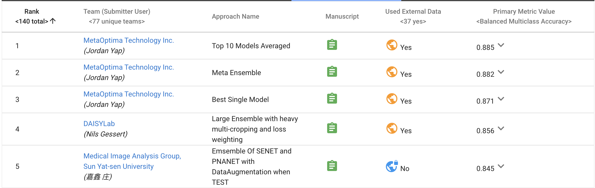
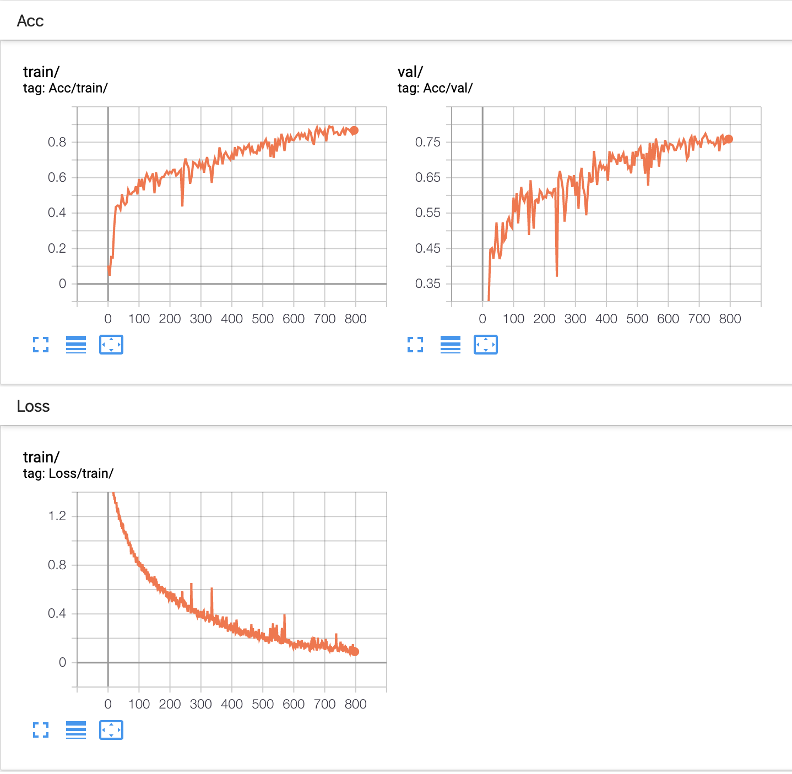

# README

New!!: Code would be updated with using some latest  approaches proposed in Nips/CVPR 2019. [2019/11/26] 

New!!: Code has been updated with very **basic settings**. [2019/11/26]

New!!: Code and README would be updated very soon [2019/11/19]


## Rank-3, MICCAI 2018 grand challenge "ISIC 2018: Skin Lesion Analysis Towards Melanoma Detection", Task 3: "Lesion Diagnosis", 2018

Note:  top 2 teams used additional **public dataset** to train models. However, our code don't use any extra data. 

You can submit your prediction to [liveboard](https://challenge2018.isic-archive.com/leaderboards/) now, if you want to find some better methods.



## 0. Directory

* src: contains all source codes
* scripts: bash scripts to train the model under different settings
* data: all images and csv file for splitting all data into training set and validation set.

```bash
. 
├── README.md
├── data
├── scripts
├── src
└── tags
```

You can download the dataset from Google Driver. 

## 1. Run

You can run the code from top directory. 

```
bash ./scripts/xxx.sh
```

## 2. Some ways to solve imbalanced data

1. median class weight
```
weight_sample_ = np.array([1113,6705,514,327,1099,115,142])/10015
weight_sample_ = 0.05132302/weight_sample_
```

2. Class weight

## 3. Training & Evaluation

See the scripts file.

### tensorboard

mca, lr 

```
tensorboard --logdir run
```




## 4. Results

Baseline

| BackBone | ACC  | MCA  |
| -------- | ---- | ---- |
| ResNet50 |      |      |
|          |      |      |
|          |      |      |

