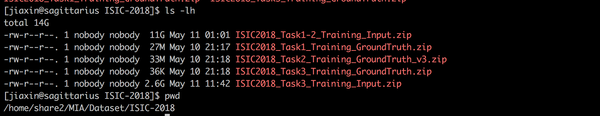

# README

New!!: Code and README would be updated very soon [2019/11/19]

## About Data
``All data has been downloaded including from task 1 to task 3 , and all of them 
are put in Lab Server 

**/home/share2/MIA/Dataset/ISIC-2018/**. 




## Directory
```
main directory
.
├── Data_Directory.png
├── README.md
├── auxiliary
│   ├── __pycache__
│   ├── inter_and_intraclass_distance.py
│   ├── process_bar.py
│   ├── statistics.py
│   └── timer.py
├── predictions
├── previous_code
│   └── tf_version
├── result
├── src_PnasNet
│   ├── confusion_matrix.py
│   ├── main.py
│   ├── models
│   └── tags
├── src_SeNet
│   ├── DataLoader.py
│   ├── FineTuneModel.py
│   ├── GetConfuse.py
│   ├── ISIC2018_Task3_Validation_Input
│   ├── ReadCSV.py
│   ├── TestDataLoader.py
│   ├── TestMCA.py
│   ├── TestResult.py
│   ├── __pycache__
│   ├── main.py
│   ├── predictions
│   ├── run.py
│   └── valid_wpr1
└── train_dir
```

## Different file functionality
```
src_PnasNet // main folder contaning code to train and generate result
```

## Using Jihan's method to process data
```
python data_utils.py --ISIC2018_Task3_Training_Input=/home/share2/MIA/ISIC2018-Sharing/jihan/ggw_p2s3
python data_utils.py --ISIC2018_Task3_Training_Input=/home/share2/MIA/ISIC2018-Sharing/jihan/gw
python data_utils.py --ISIC2018_Task3_Training_Input=/home/share2/MIA/ISIC2018-Sharing/jihan/sog6
python data_utils.py --ISIC2018_Task3_Training_Input=/home/share2/MIA/ISIC2018-Sharing/jihan/wpr1
```
output\_file will generate in src/task3\_32\_300\_400

```
mv task3\_32\_300\_400/\* /home/jiaxin/jihan/20180606/Reverse\_CISI\_Classification/data/ISIC2018/2018\_6\_4/task3\_32\_300\_400 
```

# Some ways to solve imbalanced data
1. median class weight
```
weight_sample_ = np.array([1113,6705,514,327,1099,115,142])/10015
weight_sample_ = 0.05132302/weight_sample_
```

2. Class weight


### Train & Evaluate
when running model, an event file for tensorboard would generated in current directory, named **run** 

```
python main.py --c=GPU_DEVICE_INDEX --train_file=SAVE_MODEL_PATH --logfile=LOG_PATH --model=MODEL_TO_USE

eg.

python main.py --model=pnasnet5large --train_dir=../train_dir/result173 --logfile=result173 --use_all_data=True --c=0,1,2,3 --batch_size=20 --n_epoch=150
```

### tensorboard
mca, lr 

```
tensorboard --logdir run
```

## Ref
1. [Tensorflow — Dealing with imbalanced data](https://blog.node.us.com/tensorflow-dealing-with-imbalanced-data-eb0108b10701)
2. [xgboost](https://xgboost.readthedocs.io/en/latest/get_started/index.html)
